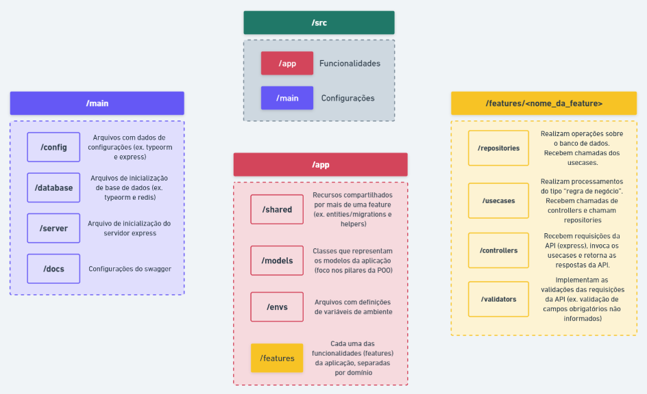

# ARQUITETURA DE SOFTWARE

Para a sequência do módulo, vamos explorar uma arquitetura que é organizada por features.
Arquitetura em camadas.



## Explicação sobre os módulos

### Main

Arquivos de configuração e inicialização de recursos.

* ```config/server```: configuração do express
* ```config/database```: configuração do typeorm
* ```config/routes```: definição base das rotas
  * As rotas de cada feature ficam na pasta da feature
* ```database```: instanciação do datasouce (typeorm)
* ```server```: instanciação do app e listen do server
  * Apontar o início do app para este arquivo no package.json

### App

Organização das features e recursos em comum entre funcionalidades.

* ```shared```: pasta com funcionalidades compartilhadas por mais de uma feature. Entities e migrations do typeorm ficam aqui. HttpHelper e demais utils também.
* ```models```: modelagem de classes (foco em POO e seus pilares)
* ```envs```: divisão das variáveis de ambiente em um arquivo separado por “objetivo”
  * Importante para não precisar importar o dotenv/config em todos os arquivos
* ```features/<nome_da_feature>```: pasta para cada feature da aplicação

### Feature

* ```controllers```: recebe uma requisição express, chama o usecase e retorna sucesso/falha baseado no retorno do usecase.
* ```usecases```: recebe um chamado do controller e realiza um tipo de regra de negócio para processar a requisição. Deve receber um DTO específico e retornar outro. Pode chamar outros usecases ou repositories.
* ```repositories```: realizam operações sobre o banco de dados. Devem receber um model como parâmetro e devolver uma instância de um model quando há retorno com dados. Trabalha com adaptação de-para com modelo <-> entity.
* ```validators```: implementam validações dos campos das requisições da API, devem ser usados como middlewares.

##

# Design Pattern

Os padrões de projeto (design patterns) são como plantas pré-projetadas de uma construção, que você pode alterar para se adequar melhor na resolução de um problema recorrente em seu código. O que diferencia os padrões de projeto das funções e bibliotecas é que **você não pode simplesmente copiá-los direto para seu programa**, já que eles não são um pedaço de código, mas sim um conceito que serve como uma solução.

Assim, para se implementar um padrão de projeto **você deve seguir o conceito dos padrões escolhidos (dentre todos os existentes) e ajustá-lo ao problema que deseja resolver**. Isso dependerá das características do projeto. Dessa forma, fazemos uma implementação que se encaixe exatamente à demanda da nossa aplicação.

# SOLID

“S” ``Single Responsibility Principle`` (Princípio de responsabilidade única): uma classe deve ter uma e apenas uma razão para mudar.

“O” ``Open-Closed Principle`` (Princípio aberto/fechado): objetos devem estar disponíveis para extensão, mas fechados para modificação.

“L” ``Liskov Substitution Principle`` (Princípio de substituição de Liskov): uma subclasse deve ser substituível por sua superclasse.

“I” ``Interface Segregation Principle`` (Princípio de segregação de interface): uma classe não deve ser obrigada a implementar métodos e interfaces que não serão utilizadas.

“D” ``Dependency Inversion Principle`` (Princípio de inversão de dependência): dependa de abstrações e não de implementações.
